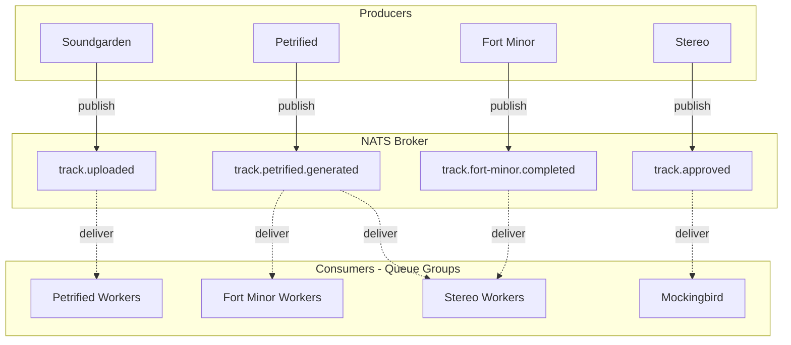

# Event Architecture Guidelines

Events are the primary mechanism for cross-module communication. This document defines naming conventions, envelope structure, payload conventions, mapping patterns, and broker flow. It is service-agnostic so implementations can evolve without changing this spec.

## Table of Contents

- [1. Event Naming Convention](#1-event-naming-convention)
- [2. Payload Conventions](#2-payload-conventions)
- [3. Event Envelope Structure](#3-event-envelope-structure)
- [4. Correlation ID (Pipeline Tracking)](#4-correlation-id-pipeline-tracking)
- [5. Domain Separation](#5-domain-separation)
- [6. Standard Event States](#6-standard-event-states)
- [7. Architecture Context](#7-architecture-context)
- [8. Mapping Events](#8-mapping-events)
- [9. Dispatching Events](#9-dispatching-events)
- [10. Subscribing to Events](#10-subscribing-to-events)
- [11. NATS Broker Flow](#11-nats-broker-flow)
- [12. Optional UI Metadata](#12-optional-ui-metadata)
- [13. Golden Rule](#13-golden-rule)
- [14. Event Inventory](#14-event-inventory)

---

## 1. Event Naming Convention

Events represent **facts that already happened**. They are emitted only when something is **concluded**. The final segment of the event name must always be in the **past tense**.

**Format:**

```
<domain>.<entity>.<state>
```

**Examples:**

- `track.upload.received`
- `track.upload.validated`
- `track.petrified.generated`
- `track.fort-minor.completed`
- `authority.user.signed_up`

### Rules

**Rule 1:** The final word must be past tense.

| Correct | Wrong |
|---------|-------|
| `track.upload.received` | `track.upload.receive` |
| `track.upload.validated` | `track.validate` |
| `track.fort-minor.completed` | `track.fort-minor.complete` |

**Rule 2:** Never emit ambiguous final states. Avoid `track.ready` because it does not describe what happened. Prefer `track.hls.stored` or `track.fort-minor.completed`.

**Rule 3:** Event structure should follow `process → state`.

**Rule 4:** Use `failed` for errors (past tense).

- `track.upload.failed`
- `track.petrified.failed`
- `track.fort-minor.failed`
- `track.stereo.failed`

**Rule 5:** Use `started` / `completed` for long async tasks (both past participles).

- `track.fort-minor.started`
- `track.fort-minor.completed`

---

## 2. Payload Conventions

Every module defines its own payloads, but these conventions improve consistency and traceability across the system.

### Recommended Properties

| Property | Type | When to use |
|----------|------|-------------|
| `entityId` | `string` | Identifier of the entity the event concerns. Use domain-specific names (`trackId`, `userId`, etc.) where appropriate. |
| `*At` timestamp | `string` (ISO 8601) | Moment the fact occurred. Suffix matches the event state: `receivedAt`, `validatedAt`, `storedAt`, `completedAt`, `generatedAt`, `approvedAt`, `rejectedAt`, `startedAt`. |
| `errorCode` | `string` | For failure events. Machine-readable code (e.g. `PROCESSING_FAILED`). |
| `message` | `string` | For failure events. Human-readable description. |
| `reason` | `string` | For decision events (approved/rejected). Explains the outcome. |
| `storage` | `{ bucket: string; key: string }` | When the event references stored artifacts. |

---

## 3. Event Envelope Structure

All events must follow the same base schema:

```json
{
  "event": "track.fort-minor.completed",
  "version": 1,
  "producer": "fort-minor",
  "timestamp": "2026-03-14T18:12:21Z",
  "correlationId": "pipeline-uuid",
  "data": {}
}
```

| Field | Description |
|-------|-------------|
| `event` | Event name (used as broker subject) |
| `version` | Schema version |
| `producer` | Producer identifier (microservice name) |
| `timestamp` | ISO timestamp |
| `correlationId` | Pipeline or workflow tracing id |
| `data` | Event payload |

---

## 4. Correlation ID (Pipeline Tracking)

Every pipeline or workflow must have a `correlationId` (e.g. UUID). All events in that pipeline share this value so downstream consumers can reconstruct the flow.

---

## 5. Domain Separation

Event domains must match responsibility. Use prefixes to separate concerns:

| Domain Prefix | Purpose | Producers |
|---------------|---------|-----------|
| `authority.*` | Authentication and session lifecycle | Authority |
| `user.*` | User profile lifecycle | Slim Shady |
| `track.*` | Track pipeline (upload, AI, transcode, storage) | Soundgarden, Petrified, Fort Minor, Stereo, Mockingbird, Hybrid Storage |

---

## 6. Standard Event States

| Lifecycle | Process | Decisions |
|-----------|---------|-----------|
| `received` | `started` | `approved` |
| `validated` | `completed` | `rejected` |
| `stored` | `failed` | |
| `generated` | | |

---

## 7. Architecture Context

The event system is built on shared packages. Kernel is the source of truth; nats-broker-messaging implements the transport.

| Package | Export | Role |
|---------|--------|------|
| `@pack/kernel` | `EventPrimitive` | Base wire envelope for all payloads |
| `@pack/kernel` | `EventBus` | Abstract class: `emit(event, payload)` and `on(event, handler)` |
| `@pack/event-inventory` | `AuthorityEvent`, `UserEvent`, `TrackEvent` | Canonical event subject enums |
| `@pack/nats-broker-messaging` | `NatsPublisher`, `NatsConsumer` | Typed publisher/consumer over NATS |
| `@pack/nats-broker-messaging` | `NatsEventBusAdapter` | Legacy adapter implementing `EventBus` |
| `@pack/nats-broker-messaging` | `NatsQueueConsumerAdapter` | Queue-group subscription adapter |

**Flow:** Modules depend on `EventBus` (from `@pack/kernel`). Infrastructure wires `NatsEventBusAdapter` or uses `NatsPublisher`/`NatsConsumer` (from `@pack/nats-broker-messaging`) to satisfy that port.

---

## 8. Mapping Events

Define event types as enums in `@pack/event-inventory`. Each microservice uses these enums for type-safe publishing and consuming.

```typescript
import { TrackEvent } from '@pack/event-inventory'

// Publishing
await eventBus.emit(TrackEvent.FortMinorCompleted, payload)

// Consuming
@EventConsumer(TrackEvent.PetrifiedGenerated)
async handle(data: ConsumeContext) { ... }
```

---

## 9. Dispatching Events

Inject an `EventBus` and call `emit` with the event name and typed payload. Emit only after the fact has occurred.

```typescript
await this.eventBus.emit(TrackEvent.Approved, {
  trackId,
  approvedAt: new Date().toISOString(),
  reason: 'Passed AI reasoning validation'
})
```

---

## 10. Subscribing to Events

Use a queue-consumer adapter so multiple instances share work (competing consumers).

```typescript
const consumer = new NatsQueueConsumerAdapter<InboundEventMap>(
  connection,
  queueGroupName
)

consumer.subscribe(TrackEvent.Uploaded, async (payload) => {
  await this.handleTrackUploaded(payload)
})
```

---

## 11. NATS Broker Flow



---

## 12. Optional UI Metadata

Events may optionally include UI feedback for dashboards or pipelines:

```json
{
  "event": "track.fort-minor.started",
  "producer": "fort-minor",
  "timestamp": "...",
  "data": {},
  "ui": {
    "message": "Transcription in progress...",
    "progress": 50
  }
}
```

---

## 13. Golden Rule

**Events must represent facts, not commands.**

| Correct | Wrong |
|---------|-------|
| `track.fort-minor.completed` | `transcribe.track` |
| `track.hls.stored` | `store.hls` |

---

## 14. Event Inventory

All event subjects are defined as enums in `@pack/event-inventory`:

- `AuthorityEvent`: `UserSignedUp`, `UserLoggedIn`, `TokenRefreshed`, `UserLoggedOut`
- `UserEvent`: `ProfileCreated`, `ProfileUpdated`, `ProfileDeleted`
- `TrackEvent`: `Uploaded`, `PetrifiedGenerated`, `PetrifiedFailed`, `DuplicateDetected`, `FortMinorStarted`, `FortMinorCompleted`, `FortMinorFailed`, `StereoStarted`, `Approved`, `Rejected`, `StereoFailed`, `HlsGenerated`, `HlsStored`
