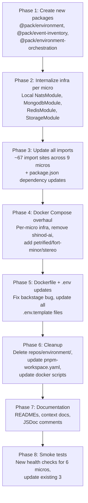

## Constraints

- **NEVER modify `@pack/kernel`** -- use its abstractions, don't change them
- **No shared infra between micros** -- each micro owns its own Mongo/Redis/MinIO
- **NATS stays shared** -- single event plane for the entire platform
- **Don't break `pnpm infra`** -- docker scripts must work end-to-end after refactoring
- **Follow GENERAL_CODE_GUIDELINE.md and BACKEND_CODE_GUIDELINE.md** throughout
- **Domain service migration is a separate task** -- this plan covers package/infra/orchestration only
- **Each phase must leave the workspace in a buildable state** -- no intermediate breakage

## Phase 8 -- Smoke Tests

### 8.1 Update Existing Smoke Tests

Update references in:
- `bin/test/smoke/authority/all.smoke.sh`
- `bin/test/smoke/soundgarden/all.smoke.sh`
- `bin/test/smoke/backstage/all.smoke.sh`

Changes: update any compose file paths or service name references if present.

### 8.2 New Smoke Tests

Add health-check scripts for micros that expose HTTP health endpoints:

| Script | Endpoint | Expected |
|--------|----------|----------|
| `bin/test/smoke/slim-shady/all.smoke.sh` | `http://localhost:7400/health` | 200 |
| `bin/test/smoke/petrified/all.smoke.sh` | `http://localhost:7201/health` | 200 |
| `bin/test/smoke/fort-minor/all.smoke.sh` | `http://localhost:7202/health` | 200 |
| `bin/test/smoke/stereo/all.smoke.sh` | `http://localhost:7203/health` | 200 |
| `bin/test/smoke/mockingbird/all.smoke.sh` | `http://localhost:7200/health` | 200 |
| `bin/test/smoke/hybrid-storage/all.smoke.sh` | `http://localhost:7300/health` | 200 |

Each script should:
1. Wait for the container to report healthy via `docker inspect`
2. Curl the health endpoint with retry logic
3. Report pass/fail

**Template**:
```bash
#!/usr/bin/env bash
set -euo pipefail

SERVICE="<micro-name>"
PORT=<port>
MAX_RETRIES=30
RETRY_INTERVAL=2

echo "Smoke testing $SERVICE on port $PORT..."

for i in $(seq 1 $MAX_RETRIES); do
  if curl -sf "http://localhost:$PORT/health" > /dev/null 2>&1; then
    echo "$SERVICE health check passed"
    exit 0
  fi
  echo "Attempt $i/$MAX_RETRIES -- waiting ${RETRY_INTERVAL}s..."
  sleep $RETRY_INTERVAL
done

echo "$SERVICE health check FAILED after $MAX_RETRIES attempts"
exit 1
```

---

## Execution Order


