# @pack/environment-orchestration

## Purpose

Local Docker Compose orchestration for the Pulse platform.

## Commands

```bash
pnpm infra
pnpm docker:up
pnpm docker:down
pnpm docker:ps
```

## Port Allocation

| Service | Ports |
| --- | --- |
| `nats` | `4222`, `8222` |
| `authority-mongo` | `27017` |
| `slim-shady-mongo` | `27018` |
| `stereo-mongo` | `27019` |
| `backstage-mongo` | `27020` |
| `petrified-redis` | `6380` |
| `fort-minor-redis` | `6381` |
| `soundgarden-minio` | `9010`, `9011` |
| `mockingbird-minio` | `9020`, `9021` |
| `hybrid-storage-minio` | `9030`, `9031` |
| `petrified-minio` | `9040`, `9041` |
| `fort-minor-minio` | `9050`, `9051` |

## Ownership

| Microservice | Infra |
| --- | --- |
| authority | `authority-mongo` |
| slim-shady | `slim-shady-mongo` |
| soundgarden | `soundgarden-minio` |
| backstage | `backstage-mongo` |
| petrified | `petrified-redis`, `petrified-minio` |
| fort-minor | `fort-minor-redis`, `fort-minor-minio` |
| stereo | `stereo-mongo` |
| mockingbird | `mockingbird-minio` |
| hybrid-storage | `hybrid-storage-minio` |

## Topology

```mermaid
flowchart TD
  nats[nats]
  authority --> authorityMongo[authority-mongo]
  slimShady --> slimMongo[slim-shady-mongo]
  backstage --> backstageMongo[backstage-mongo]
  stereo --> stereoMongo[stereo-mongo]
  soundgarden --> soundMinio[soundgarden-minio]
  mockingbird --> mockMinio[mockingbird-minio]
  hybridStorage --> hybridMinio[hybrid-storage-minio]
  petrified --> petRedis[petrified-redis]
  petrified --> petMinio[petrified-minio]
  fortMinor --> fortRedis[fort-minor-redis]
  fortMinor --> fortMinio[fort-minor-minio]
  authority --> nats
  slimShady --> nats
  soundgarden --> nats
  backstage --> nats
  petrified --> nats
  fortMinor --> nats
  stereo --> nats
  mockingbird --> nats
  hybridStorage --> nats
```


